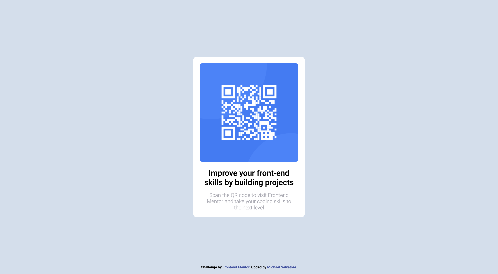

# Frontend Mentor - QR code component solution

This is a solution to the [QR code component challenge on Frontend Mentor](https://www.frontendmentor.io/challenges/qr-code-component-iux_sIO_H). Frontend Mentor challenges help you improve your coding skills by building realistic projects. 

## Table of contents

- [Overview](#overview)
  - [Screenshot](#screenshot)
  - [Links](#links)
- [My process](#my-process)
  - [Built with](#built-with)
  - [What I learned](#what-i-learned)

## Overview

### Screenshot

### Links

- Solution URL: [Add solution URL here](https://github.com/msalvatore22/Frontend-Mentor---QR-code-component)
- Live Site URL: [Add live site URL here](https://msalvatore22.github.io/Frontend-Mentor---QR-code-component/m)

## My process
Analyzed the design images and made inital design decisions. Decided flexbox and simple CSS styling would do the trick to replicate the design.

### Built with

- Semantic HTML5 markup
- CSS custom properties
- Flexbox

### What I learned

* Freshen up on CSS skills
* Linking Google Fonts into HTML
